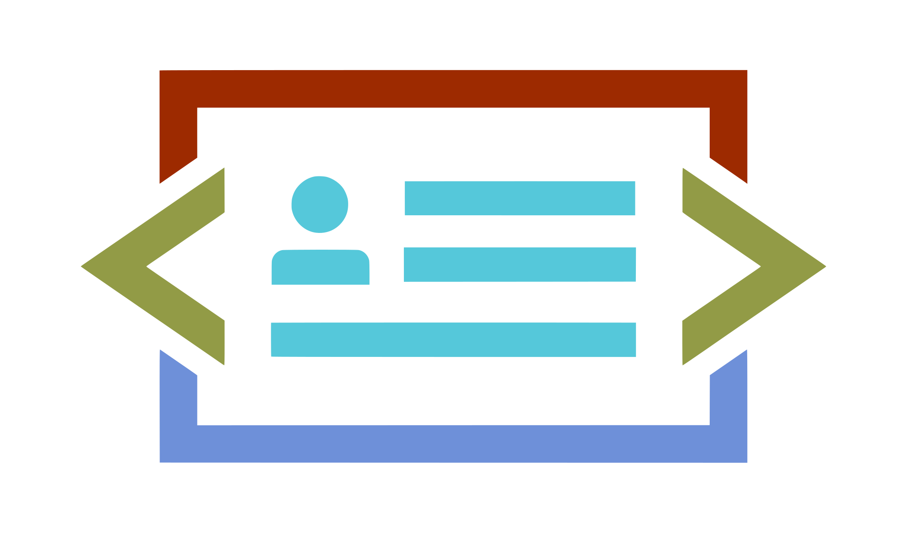
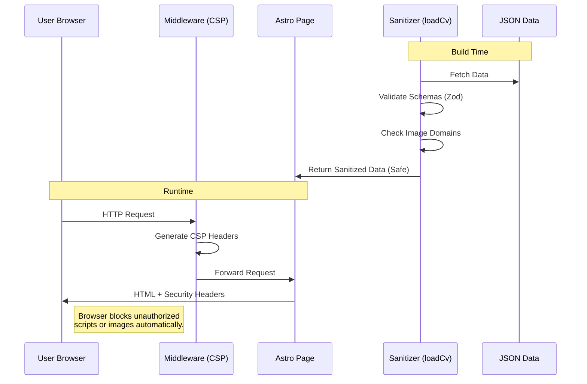

# 🚀 Open Portfolio



> **Developer Portfolio "Framework".**
> Built with **Astro**, **TypeScript**, **Tailwind**, and **Zod**.

[](https://astro.build) [](https://github.com/ellerbrock/open-source-badges) [](https://opensource.org/licenses/MIT)

**Open Portfolio** is not just a template: it's a static site generator framework designed specifically for developers. It separates **Content** (JSON), **Configuration** (TypeScript), and **Presentation** (Themes), allowing you to build a professional, type-safe, and secure portfolio in minutes.

## ✅ Features

- [x] **Clean Architecture** (Separation of concerns)
- [x] **Type-Safe Content** (Zod Validation)
- [x] **Automated i18n** (Routing & Fallbacks)
- [x] **Decoupled Theme System** (Switch themes easily)
- [x] **Extreme Performance** (Static build, Asset optimization)
- [ ] **Security** (CSP, Sanitization `In development`)
- [ ] **Download CV as PDF** (`In development`)
- [ ] **Download Themplates from github** (`In development`)

---

## 🏗️ Architecture

Open Portfolio follows a **Clean Architecture** approach, ensuring that your data is strictly validated before it ever reaches the UI layer.

### 1. High-Level Data Flow
The framework acts as a pipeline that transforms your raw JSON data into a performant static website.

```mermaid
graph LR
    A[User Config] --> D{Core Engine}
    B[CV Content (JSON)] --> D
    C[Selected Theme] --> D
    
    subgraph "Core Engine (Build Time)"
    D --> E[Zod Validation]
    E --> F[Data Sanitizer]
    F --> G[i18n Processor]
    G --> H[Astro SSG Build]
    end
    
    H --> I[Static HTML/CSS/JS]
    I --> J((Production Deployment))
```


### 2. The Security Fortress (Defense in Depth)
We implement a two-layer security strategy to prevent XSS and unoptimized asset loading.

* **Layer 1 (Build Time):** The `loadCv` utility sanitizes malicious URLs from the JSON based on your allowlist.
* **Layer 2 (Runtime/Browser):** The Middleware injects a strict **Content Security Policy (CSP)**.



---

## ✨ Key Features

* **🛡️ Type-Safe Content:** Your CV is defined in `src/content/cv/`. If you make a typo or miss a required field, the build fails with a descriptive error.
* **🌍 Automated i18n:** Just add translations to your JSON objects. The framework automatically generates routes (e.g., `/es`, `/en`) and handles fallback logic.
* **🎨 Decoupled Theme System:** Switch from a "Minimal" look to a "Cyberpunk" look by changing **one line** of code. Themes are installed via CLI.
* **⚡ Extreme Performance:** Images are optimized at build time using `astro:assets` (WebP generation).
* **🔒 Enterprise Security:** Automatic CSP injection and JSON sanitization.

---

## 🚀 Quick Start

### 1. Prerequisites
You need **Node.js 18+** and **Bun** (recommended) or NPM/PNPM.

### 2. Installation

```bash
# Clone the repository
git clone [https://github.com/your-username/open-portfolio.git](https://github.com/your-username/open-portfolio.git)

# Enter the directory
cd open-portfolio

# Install dependencies
bun install
```

### 3. Development Server

```bash
bun dev
```
Visit `http://localhost:4321`. The site will automatically redirect you based on your browser's language.

---

## ⚙️ Configuration

Control the behavior of your site from `portfolio.config.ts`. This file is fully typed, so your IDE will autocomplete available options.

```typescript
// portfolio.config.ts
export const config: PortfolioConfig = {
  site: {
    title: "Alex Dev",
    description: "Full Stack Developer",
    url: "[https://alex.dev](https://alex.dev)",
  },
  data: {
    cvFile: "me", // Loads src/content/cv/me.json
  },
  i18n: {
    defaultLocale: "en",
    locales: ["en", "es"], // Automatic routing for these languages
  },
  theme: {
    name: "minimal", // The active theme folder
  },
  features: {
    security: {
      restrictExternalScripts: true,
      allowedImagesDomains: ["github.com", "i.imgur.com"] // Firewall for images
    }
  }
};
```

---

## 📝 Content Management

Your data lives in `src/content/cv/`. You can create multiple files (e.g., `me.json`, `anon.json`) and switch between them in the config.

### Structure of `src/content/cv/me.json`
Everything is validated by Zod schemas.

```json
{
  "basics": {
    "name": "Gordon Freeman",
    "label": "Theoretical Physicist",
    "image": "[https://upload.wikimedia.org/](https://upload.wikimedia.org/)...",
    "summary": "Specialized in hazardous environments.",
    
    "i18n": {
      "es": {
        "label": "Físico Teórico",
        "summary": "Especializado en entornos peligrosos."
      }
    }
  },
  "work": [ ... ]
}
```


### Validating your Data
Before deploying, run the validation script to ensure your JSON integrity:

```bash
bun run validate
```

---

## 🎨 Theme Manager (CLI) (⚠️ WIP ⚠️)
> ⚠️ **Note:** This feature is currently under development and is not yet functional.

Open Portfolio includes a built-in CLI to manage themes without manually copying files.

```bash
bun run theme
```

**Options:**
1.  **Official Themes:** Download curated themes from the registry.
2.  **GitHub URL:** Install any community theme by typing `user/repo`.

**Creating a Theme:**
1.  Create a folder in `src/themes/my-theme`.
2.  Create an `index.astro` file.
3.  It **must** accept a `cv` prop typed with the `CV` interface.

```astro
---
import type { CV } from '@/schemas/cv';
interface Props { cv: CV; }
const { cv } = Astro.props;
---
<h1>{cv.basics.name}</h1>
```

---

## 📂 Project Structure

```text
.
├── public/                 # Static assets (favicon, robots.txt)
├── src/
│   ├── components/         # Global shared components (SEO, UI)
│   ├── content/
│   │   ├── config.ts       # Content Collections definition
│   │   └── cv/             # Your JSON data files live here
│   ├── layouts/            # Base HTML layouts
│   ├── pages/
│   │   ├── index.astro     # Smart Redirector (Gatekeeper)
│   │   └── [lang].astro    # Dynamic Router & Theme Loader
│   ├── schemas/            # Zod definitions for validation
│   ├── themes/             # Installed themes folder
│   ├── utils/              # Core logic (loadCv, translations)
│   └── middleware.ts       # Security & CSP Injection
├── scripts/                # CLI Tools (validate, theme-manager)
├── astro.config.ts         # Astro Framework Config
└── portfolio.config.ts     # User Configuration
```

---

## 🤝 Contributing

We welcome contributions! Please see the issues tab for "Good First Issues".

1.  Fork the repository.
2.  Create a feature branch (`git checkout -b feature/amazing-feature`).
3.  Commit your changes.
4.  Push to the branch.
5.  Open a Pull Request.

---

## 📄 License

This project is distributed under the **MIT License**. It is open-source and non-profit, allowing anyone to use, modify, and distribute the code freely. See the `LICENSE` file for more details.